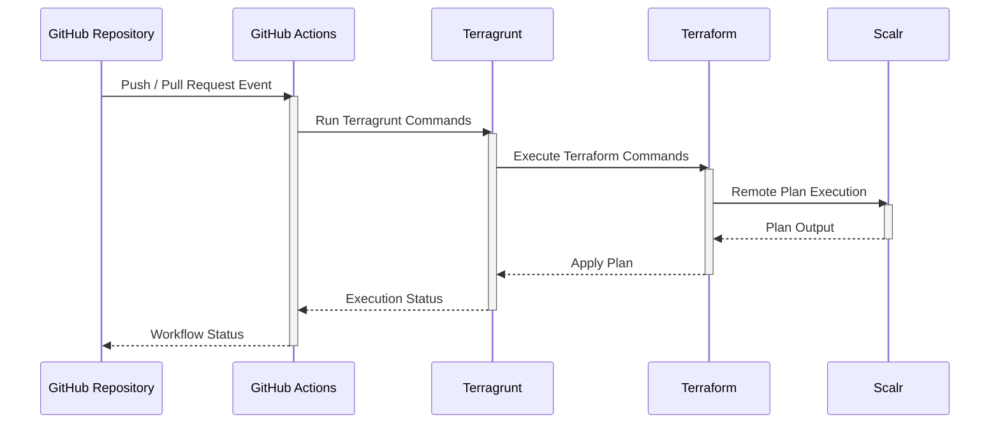

# scalr-examples
Just some boilerplate to test out Scalr stuff, the execution of this code looks like this

```mermaid
sequenceDiagram
    participant GitHubRepo as GitHub Repository
    participant GitHubActions as GitHub Actions
    participant Terragrunt as Terragrunt
    participant Terraform as Terraform
    participant Scalr as Scalr

    GitHubRepo->>GitHubActions: Push / Pull Request Event
    activate GitHubActions

    GitHubActions->>Terragrunt: Run Terragrunt Commands
    activate Terragrunt

    Terragrunt->>Terraform: Execute Terraform Commands
    activate Terraform

    Terraform->>Scalr: Remote Plan Execution
    activate Scalr

    Scalr-->>Terraform: Plan Output
    deactivate Scalr

    Terraform-->>Terragrunt: Apply Plan
    deactivate Terraform

    Terragrunt-->>GitHubActions: Execution Status
    deactivate Terragrunt

    GitHubActions-->>GitHubRepo: Workflow Status
    deactivate GitHubActions

```
